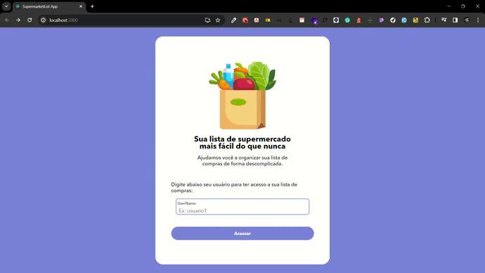

<h1 align="center" style="    max-width: 250px;
    margin: 30px 0;">
    <br>
    Supermarket List App.
</h1>

<p align="center">
  <a href="#result">Result.</a>&nbsp;&nbsp;&nbsp;|&nbsp;&nbsp;&nbsp;
  <a href="#about-the-project">About the project.</a>&nbsp;&nbsp;&nbsp;|&nbsp;&nbsp;&nbsp;
  <a href="#live-application">Live application.</a>&nbsp;&nbsp;&nbsp;|&nbsp;&nbsp;&nbsp;
  <a href="#technologies">Technologies.</a>&nbsp;&nbsp;&nbsp;|&nbsp;&nbsp;&nbsp;
  <a href="#requirements-to-run">Requirements to Run</a>&nbsp;&nbsp;&nbsp;|&nbsp;&nbsp;&nbsp;
  <a href="#running-instructions">Running Instructions</a>
</p>

## Result:

  <div style="display: flex;   flex-direction: column;
  align-items: center;">
  <h1 align="center" style="display: flex; flex-direction:row;">
      
  </h1>
  </div>

## About the project:

This application is built using React.js to make it easier to create supermarket lists. It was used the Atomic Design Concept to organize the components.

## Live application:

https://supermarket-list-frontend-navy.vercel.app/

## Technologies:

This application was developed with the following technologies:

- React.js;
- Styled Components;
- Atomic Design;
- Eslint;
- Prettier;
- Absolute Imports;
- Git;
- Axios;

## Requirements to Run:

- Node.js (https://nodejs.org/en/)

## Running Instructions

1. Clone the project:

```
 git clone https://github.com/LuannLopes/supermarket-list-frontend.git
```

2. Install the dependencies:

```
 cd supermarket-list-frontend && npm install
```

3. Run the project:

```
 npm start
```
